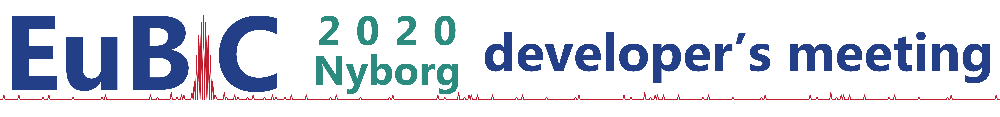

# EuBIC 2018 developer's meeting
### 9&ndash;12 January 2018, Ghent, Belgium

The EuBIC 2018 developer's meeting will bring together scientists active in the field of bioinformatics and computational proteomics.

This repository will contain some information related to the EuBIC 2018 developer's meeting.

For more information, please check the **[official website](http://uahost.uantwerpen.be/eubic18/)**.

## Project proposal submission

Topics for the hackathon sessions during the EuBIC 2018 developer's meeting can now be proposed!

Please carefully read the **[full guidelines](http://uahost.uantwerpen.be/eubic18/submission.html)** before submitting a project proposal and make sure to add all relevant information to your proposal.

### How to submit a project proposal?

Create an issue in this repository describing your project. When creating an issue a template is provided listing some of the relevant information that should be included:

**Project description:**

- A general abstract of up to 200 words describing the goal of the project and why it is well suited as a community project.
- A (high-level) project plan detailing the work to be conducted. This primarily includes tasks that will be tackled during the developer's meeting, but we encourage you to also think about a follow-up strategy.

**Technical details:**

- The programming language(s) that will be used.
- (If applicable) any existing software that will be featured.
- (If applicable) any datasets that will be used and their availability.

**Contact information:**

- Your name, affiliation, and contact information.

### How to contribute?

- Vote for your favorite projects in the issue tracker to show your support.
- Leave comments to the most interesting proposals. Engage in a discussion to finetune the project proposals!